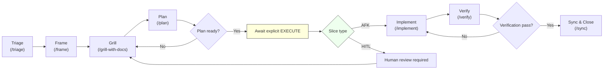

# pi.dev

Personal workspace for advanced agentic coding workflows, specialized skills, and specialized mindsets.

## 🚀 R&D Agentic Workflow

This repository implements a high-performance "Staff Engineer" workflow for the Pi Coding Agent. Every task follows a disciplined lifecycle:

1.  **Triage (`/triage`)**: The entry point. Fetches Jira/GitHub/GitLab tasks and initializes a namespaced workspace in `.workflow/tasks/`.
2.  **Frame (`/frame`)**: Formalizes the work. Writes a concise brief into the active task's WORK.md (`[BRIEF]` section). Do not create separate `PROBLEM.md` or `PRD.md` files.
3.  **Grill (`/grill-with-docs`)**: Stress-tests the brief and plan against `CONTEXT.md` and `docs/agents/*`. No planning until the design is solid.
4.  **Plan (`/plan`)**: TDD-first, vertical slice strategy. Use `/sync` or `/to-jira` to sync slices back to PMs when appropriate.
5.  **Implement (`/implement`)**: Executes the plan in functional milestones. Supports multi-commit slices; run `/verify` after a slice.
6.  **Verify (`/verify`)**: A holistic "Truth Test" (Code + Docs + System Zoom Out). Update `[LOG]` and recommend `/sync`.

Workflow-driven skills should read `AGENTS.md`, `pi/AGENTS.md`, and `pi/skills/README.md` before editing workflow rules. Use `jira:`, `github:`, `gitlab:`, or `local:` prefixes for namespacing.

## RPIV flow (Mermaid)




## 🧠 Mindsets (Hats)

Configured via `pi/shell_integration.sh`:
- **RPIV Hat (`--rpiv`)**: Full Lean RPIV workflow (triage, frame, grill-with-docs, plan, implement, verify, sync, update-docs).
- **Android Hat (`--android`)**: Specialized for KMP/Android development with quality gates.
- **PM Hat (`--pm`)**: Product/PM workflows (search, triage, frame, grill-with-docs, plan, sync).
- **Dev Hat (`--dev`)**: Developer-focused skills for implementation, verification, and sync.
- **Meta Hat (`--meta`)**: Skill creation, meta workflows, and env-protection helpers.
- **Write Hat (`--write`)**: Documentation and writing-focused skills.
- **Antigravity Hat (`--antigravity`)**: Experimental antigravity extension; loads `pi/extensions/antigravity-auth-login`.

## 📂 Artifacts & Anti-Bloat

- **Task Workspace**: All temporary work lives in `.workflow/tasks/[source-id]/`. This is git-ignored.
- **Single source of truth per task**: Use `.workflow/tasks/[source-id]/WORK.md` with guarded sections: `[BRIEF]`, `[GRILL]`, `[PLAN]`, `[LOG]`, `[META]`.
- **Context**: Durable rules belong in `docs/agents/` (e.g., `domain.md`, `tech-stack.md`, `workflow.md`). Use `/update-docs` to curate durable docs.

## 📚 Terminology & Glossary

For a detailed breakdown of LLM metrics (Context, Caching, Tokens), see the [Agentic Terminology Guide](docs/agents/terminology.md).

## 🛠 Skills

Located in `pi/skills/`:
- `workflow/`: Core Lean RPIV skills.
- `android/`: Android-specific toolkits.
- `search/`: Brave Search integration.

## 🔌 Extensions

Located in `pi/extensions/`:
- `clean-repo/`: git cleanup helper
- `powerline-footer/`: footer styling
- `gemini-api/`: manual-only public Gemini API provider (`gemini-api/...`)
- `antigravity-auth-login/`: manual-only, experimental Antigravity OAuth/login provider (`antigravity-cli/...`)

Run `./scripts/setup.sh` after cloning to symlink the default repo-local extensions into `~/.pi/agent/extensions/`.
Load `gemini-api` manually when you need it:

```bash
pi -e ./pi/extensions/gemini-api
```

Load `antigravity-auth-login` manually when you want the OAuth login flow back for investigation:

```bash
pi --antigravity
# or
ANTIGRAVITY_DEBUG=1 pi -e ./pi/extensions/antigravity-auth-login
```

By default this now registers as `antigravity-cli/...` and uses a direct custom-provider `streamSimple` transport instead of relying on built-in `google-gemini-cli` runtime dispatch. A minimal latest-Pi `gemini-3-flash` print-mode request is now verified end-to-end.

On latest Pi, this path is still experimental. Use `/antigravity.doctor` after startup and check `pi/extensions/antigravity-auth-login/README.md` for the current version matrix, diagnostics workflow, and fallback pinning criteria.

Set `GEMINI_API_KEY` or `GOOGLE_API_KEY` in your shell rc (`~/.zshrc`, etc.) if you want Gemini models available in that session.

---
*Never Trust AI. Always Manual Review. Verify Every Change.*

## 🛰 Antigravity extension — why I built it

Heads-up: I implemented a replacement "antigravity" extension that targets pi-mono v0.71.0 because the upstream project removed the original support in the v0.71.0 release (see: https://github.com/badlogic/pi-mono/releases/tag/v0.71.0). In short: they decided to remove the feature, so I built one to restore the functionality for projects that depend on it.

Why this matters
- Compatibility: Some projects (and quick internal prototypes) relied on the antigravity helper. Removing it in v0.71.0 broke those flows.
- Minimal surface area: the replacement targets the same public surface as the removed feature and aims to be small and well-tested.

Suggested commit/PR message for the change in this repo:
- feat(extensions): add antigravity extension (target: pi-mono v0.71.0) — restore removed antigravity helper

If you want, I can add more context (design notes, tests, and migration notes) to the extension's README or a dedicated PR description.

