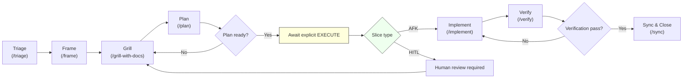

# RPIV Workflow — Quick Guide

A concise, practical guide for using the Lean RPIV workflow in this repo. Includes a mermaid diagram that shows the canonical flow (Triage → Frame → Grill → Plan → Implement → Verify) and usage examples for the `pi` agent.

> Rendering note: the mermaid diagram requires a renderer that supports Mermaid (GitHub, VSCode preview with Mermaid, or other MD renderers).

## Overview

Lean RPIV phases and the primary agent commands:

- Triage: `/triage [source]:[id]` — fetch remote issue and create/resume `.workflow/tasks/[source-id]/WORK.md` (and `metadata.json`).
- Frame: `/frame` — write a concise brief into `WORK.md` -> `[BRIEF]` (no separate `PROBLEM.md` or `PRD.md`).
- Grill: `/grill-with-docs` — validate brief and decisions against `CONTEXT.md` and `docs/agents/*`; record results in `[GRILL]`.
- Plan: `/plan` — draft thin, verifiable vertical slices in `WORK.md` -> `[PLAN]`. Mark each slice AFK or HITL.
- Implement: `/implement` — implement one approved AFK slice (agent acts only when the user explicitly authorizes execution).
- Verify: `/verify` — run verification commands, append evidence to `[LOG]`, and recommend `/sync` when ready.

## Mermaid flowchart



This diagram shows the happy path and decisions around AFK vs HITL slices. The agent must wait for explicit execution approval before running filesystem-modifying commands.

## WORK.md template (canonical guarded sections)

Use the single-file source-of-truth pattern at `.workflow/tasks/[source-id]/WORK.md` with these guarded sections:

- `[BRIEF]` — concise type, summary, desired outcome, constraints, non-goals, acceptance hints.
- `[GRILL]` — decisions, evidence, references to `docs/agents/*` and `CONTEXT.md`.
- `[PLAN]` — vertical slices with checkboxes and per-slice verification commands. Mark each slice `AFK` (agent-implementable) or `HITL` (human-in-the-loop).
- `[LOG]` — implementation & verification history (commits, PRs, hashes, verification output).
- `[META]` — remote links, metadata.json summary, local branch name, tracking ids.

Example excerpt:

```
[BRIEF]
Type: Bug
Source: github-42
Summary: Fix crash when X happens.
Constraints: must not change public API.
Acceptance: repro steps + no regression on Y suite.

[GRILL]
Decision: prefer option A due to perf impact. See docs/agents/tech-stack.md

[PLAN]
- [ ] Slice 1 - AFK - Add validation (verify: ./scripts/test-slice-1)
- [ ] Slice 2 - HITL - Product review required

[LOG]
- 2026-05-11: triage created; metadata imported.

[META]
remote: https://github.com/org/repo/issues/42
```

## How to run (example session)

1. Start with a hat that suits the intent:

```bash
# full RPIV mindset
pi --rpiv

# or a developer-focused hat
pi --dev
```

2. Create the task workspace (triage):

```
/triage github:42
```

3. Frame the task (write the brief):

```
/frame
```

4. Grill the plan against docs and code:

```
/grill-with-docs
```

5. Draft the plan:

```
/plan
```

6. When the plan is ready, the human gives explicit permission to implement. The agent will NOT implement until the user says: EXECUTE

```
# human confirmation (example)
EXECUTE

# then run implement
/implement
```

7. After implementation, verify and sync:

```
/verify
/sync
```

## Guardrails & best practices

- NEVER implement during planning. The agent must wait for an explicit EXECUTE instruction before any filesystem-modifying actions.
- Keep task work inside `.workflow/tasks/` and never commit interim planning files to the repo.
- Make vertical slices small and independently verifiable.
- Label slices AFK vs HITL. AFK slices can be implemented by the agent after EXECUTE, HITL slices require a human decision/review step.
- Include explicit verification commands per slice and required quality gates.
- Commit messages: Use Conventional Commits and include an `Assisted-by:` footer when the agent contributed (human must certify DCO/Signed-off-by).
  - For Jira-tracked tasks, put the Jira key in the subject line itself (`fix(PROJ-123): ...`), not only in the body/footer.

## Troubleshooting & tips

- If the agent attempts to modify the filesystem while the user is still planning, stop and remind it of the execution guardrail.
- Use `/grill-with-docs` early to surface noteworthy constraints from `docs/agents/*`.
- For long or complex rules, prefer adding concise durable guidance to `docs/agents/` via `/update-docs` rather than leaving lengthy notes in `WORK.md`.

---

If you want, I can:
- Add this file to the repo (I will commit with a Conventional Commit message and push), or
- Embed the mermaid diagram into README.md or a different doc page.

Which do you prefer? (If you want it added now, reply with EXECUTE.)
